# A Yen for the Future

## Background

The financial departments of large companies often have to make foreign currency transactions when doing international business, while hedge funds are also interested in anything that will provide an edge in predicting currency movements. Hence, both are always eager to gain a better understanding of the future direction and risk of various currencies. 

I will be testing the many time series tools that you have learned in order to predict future movements in the value of the Canadian dollar versus the Japanese yen.

Project Target:

1. Time series forecasting
2. Linear regression modelling

- - -

### Files

[Time-Series Starter Notebook](Starter_Code/time_series_analysis.ipynb)

[Linear Regression Starter Notebook](Starter_Code/regression_analysis.ipynb)

[CAD/JPY Data CSV File](Starter_Code/cad_jpy.csv)

- - -

#### Time-Series Forecasting

In this notebook, you will load historical CAD-JPY exchange rate data and apply time series analysis and modelling to determine if there is any predictable behaviour.

Follow the steps outlined in the time series starter notebook to complete the following:

1. Decomposition using a Hodrick-Prescott filter (decompose the settle price into trend and noise).

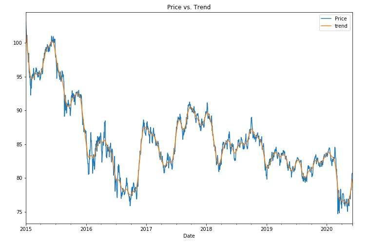

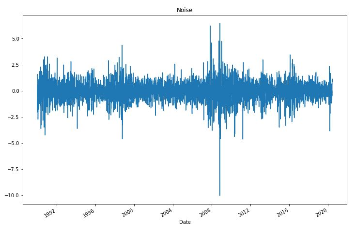

2. Forecasting returns using an ARMA model.

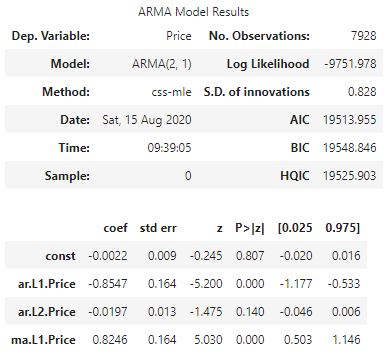

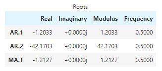

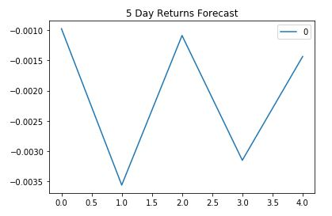

3. Forecasting the exchange rate price using an ARIMA model.

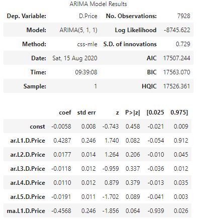

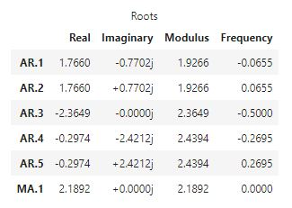

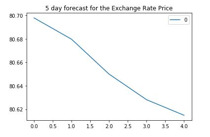

4. Forecasting volatility with GARCH.

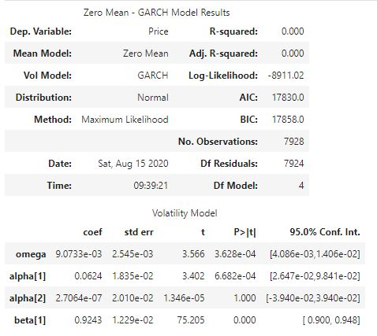

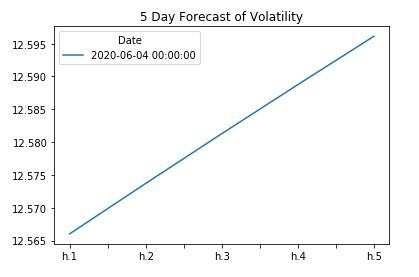

Use the results of the time series analysis and modelling to answer the following questions:

1. Based on your time series analysis, would you buy the yen now?
    - Based on the time series analysis, although exchange rate will decrease, it is very volitile and fluctuation in price; therefore, there is a risk. I believe Japanese Yen is decreasing in the near term so I would not buy the Yen now.

2. Is the risk of the yen expected to increase or decrease?
    
    - Using Garch model, CAD/JPY volatility is expected to rise over the next 5 days
    - The risk is expected to increase for Japanese Yen

3. Based on the model evaluation, would you feel confident in using these models for trading?

    - No. By looking at the p-values, I am not too confident in using these models.
    - Out of 3 models, Garch is the best fit. ARMA is worse than Garch but better than ARIMA.
    - If I need to use these 3 models, I would use Garch model for trading

#### Linear Regression Forecasting

In this notebook, you will build a Scikit-Learn linear regression model to predict CAD/JPY returns with *lagged* CAD/JPY futures returns and categorical calendar seasonal effects (e.g., day-of-week or week-of-year seasonal effects).

Follow the steps outlined in the regression_analysis starter notebook to complete the following:

1. Data preparation (creating returns and lagged returns, and splitting the data into training and testing data)

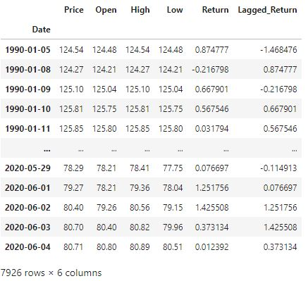

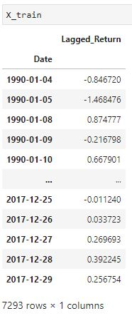
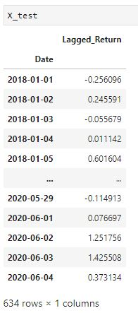
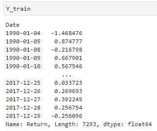
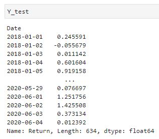

2. Fitting a linear regression model.

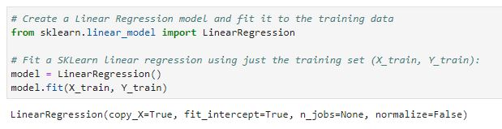

3. Making predictions using the testing data.

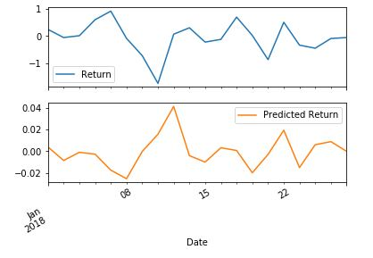

4. Out-of-sample performance.

* Out-of-sample Root Mean Squared Error (RMSE): 0.6445805658569028

5. In-sample performance.

* In-sample Root Mean Squared Error (RMSE): 0.841994632894117

Use the results of the linear regression analysis and modelling to answer the following question:

## Does this model perform better or worse on out-of-sample data compared to in-sample data?
- RMSE for Out-of-sample is lower (0.64) as compared to in-sample (0.84). 
- This model performs better on out-of-sample data
- - -

### Hints and Considerations

* Out-of-sample data is data that the model hasn't seen before (testing data).
* In-sample data is data that the model was trained on (training data).

- - -

© 2020 Trilogy Education Services, a 2U, Inc. brand. All Rights Reserved.

